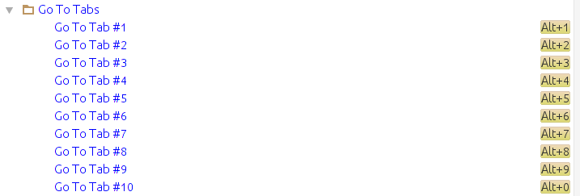

# Go To Tabs for IntelliJ IDEA and others

The plugin adds menu actions allowing you to go to a specific tab. You can of course assign keyboard shortcuts the individual actions and for example achieve the behavior known from other editors/IDEs where you can switch between tabs with <i>alt+&lt;num&gt;</i>.

To prevent any conflicts, the plugin doesn't assign any shortcuts by itself, you need to do it manually in the Keymap (section Main menu -> Window -> Editor Tabs -> Go To Tabs).
